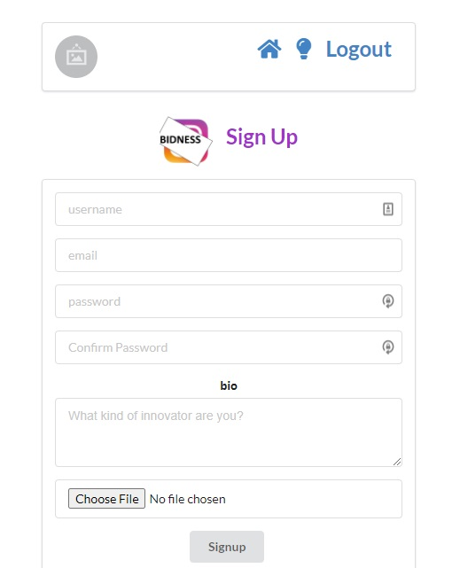

# Bidness

Bidness is a revolutionary new tool for creating earth shaking business ideas.  

## Purpose

The purpose of this app was and is to try and get my head around the MERN stack.

## Technologies Used

    1. React
    2. mongoose/mongodb
    3. express
    4. AWS/ S3
    5. token based authentication
    6. CSS

## Getting Started

[trello](https://trello.com/b/BnuVBCE0/bidness)

[app on heroku](https://seriousbidness.herokuapp.com)

## Next Steps

I plan on adding one or two more features before starting on a much more ambitious project.  I would like to iron out the general UX/UI.  For instance, there should be more user feedback when a new idea is created.  I would like to also use the linkin API to push these business ideas up as fake job experiences.  